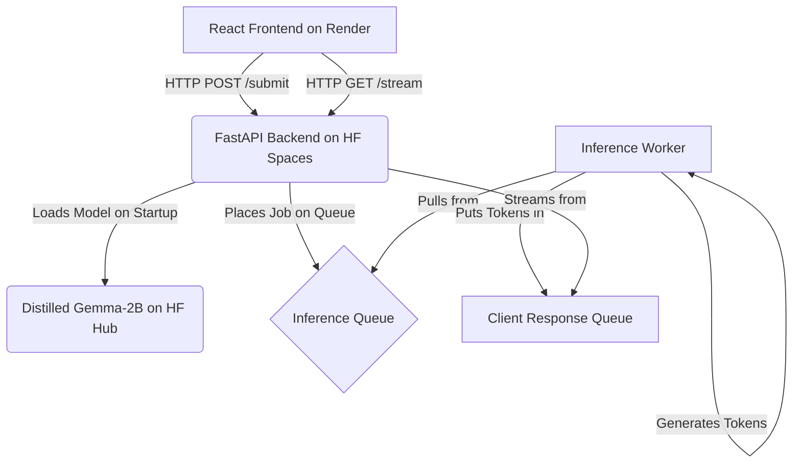

# LLM Distillation Suite: A Full-Stack Distilled Model Server

[](https://opensource.org/licenses/MIT)
[](https://huggingface.co/im-utkarsh/distilled-gemma-squad-model)
[](https://huggingface.co/spaces/im-utkarsh/distilled-gemma-squad)

An end-to-end application demonstrating the distillation of a large Gemma-7B language model into a smaller, faster Gemma-2B student model, served via a streaming REST API with a reactive web interface.


## Table of Contents

- [LLM Distillation Suite: A Full-Stack Distilled Model Server](#llm-distillation-suite-a-full-stack-distilled-model-server)
	- [Table of Contents](#table-of-contents)
	- [About The Project](#about-the-project)
		- [Problem Solved](#problem-solved)
		- [What I Learned](#what-i-learned)
	- [Tech Stack](#tech-stack)
	- [Architecture](#architecture)
	- [Getting Started](#getting-started)
		- [Prerequisites](#prerequisites)
		- [Installation](#installation)
	- [Deployment](#deployment)

## About The Project

This project was developed as part of my Master's final year project, exploring techniques to make powerful LLMs more accessible and efficient for real-world applications on resource-constrained devices.

### Problem Solved

Large language models are computationally expensive and have high latency, making them impractical for many interactive applications. This project implements **knowledge distillation** to create a smaller "student" model (Gemma-2B) that retains a significant portion of the "teacher" model's (Gemma-7B) capabilities on the SQuAD dataset, while being drastically faster and cheaper to run.

### What I Learned

-   Implementing the distillation loss function and fine-tuning both teacher and student models using the Hugging Face `transformers` library.
-   Building a robust, non-blocking, and scalable API with **FastAPI** to serve the model, featuring a queued inference system and Server-Sent Events (SSE) for real-time token streaming.
-   Developing a modern, type-safe frontend with **React, TypeScript, and Vite**, featuring a retro CRT-themed UI and efficient state management for a seamless user experience.
-   Orchestrating a full-stack MLOps pipeline, from model experimentation and deployment on the Hugging Face Hub to a live, interactive application.

## Tech Stack

-   **Machine Learning**: Python, PyTorch, Hugging Face (Transformers, Accelerate)
-   **Backend**: FastAPI, Uvicorn, SSE-Starlette
-   **Frontend**: React, TypeScript, Vite, Tailwind CSS
-   **Deployment**: Hugging Face Hub (Model), Hugging Face Spaces (Backend), Render (Frontend)

## Architecture



## Getting Started

To get a local copy up and running, follow these simple steps.

### Prerequisites

-   Python 3.11+
-   Node.js v18+
-   Git

### Installation

1.  **Clone the repository:**
    ```sh
    git clone [https://github.com/your-username/llm-distillation-suite.git](https://github.com/your-username/llm-distillation-suite.git)
    cd llm-distillation-suite
    ```
2.  **Setup the Backend (`/apps/api`):**
    - Navigate to the API directory: `cd apps/api`
    - Create a virtual environment: `python -m venv venv`
    - Activate it: `.\venv\Scripts\activate` (Windows)
    - Install dependencies: `pip install -r requirements.txt`
    - Run the server: `uvicorn app.main:app --host 0.0.0.0 --port 7860 --reload`
    The API will be running at `http://localhost:7860`.

3.  **Setup the Frontend (`/apps/web`):**
    - In a new terminal, navigate to the web directory: `cd apps/web`
    - Install dependencies: `npm install`
    - Create a `.env.development` file and add the API URL:
      ```
      VITE_API_URL=http://localhost:7860
      ```
    - Run the development server: `npm run dev`
    The frontend will be running at `http://localhost:5173`.

## Deployment

-   **Model**: The distilled Gemma-2B model is hosted on the [Hugging Face Hub](https://huggingface.co/im-utkarsh/distilled-gemma-squad-model).
-   **Backend**: The FastAPI application is deployed as a [Hugging Face Space](https://huggingface.co/spaces/im-utkarsh/distilled-gemma-squad).
-   **Frontend**: The React application is intended for deployment on a static hosting service like Render or Vercel.